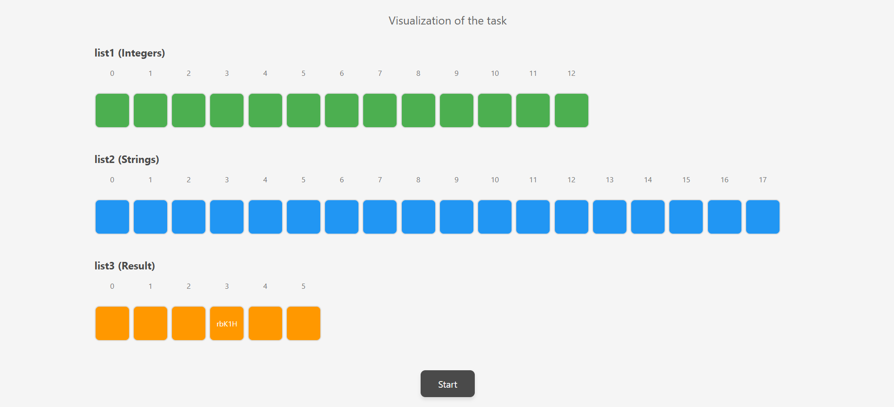

ListConverter - 2n-1 Algorithm Implementation
Overview
ListConverter is a Java application that implements a specialized algorithm combining the 2n-1 mathematical formula with a systematic element removal process. The program processes two lists: a list of integers and a list of strings, applying complex logic to produce a final filtered result.
Task Demonstration
📹 Screen Recording: A complete demonstration of the task implementation and results is available at:
https://drive.google.com/file/d/1WXmvXuZ2UBkhk6UG25RDl9BFiTRvdt1n/view?usp=drive_link
here is screenshot of animation:()
This recording shows and screenshot: 

The complete execution of the ListConverter program
Step-by-step processing using the 2n-1 formula
The systematic removal algorithm in action
Final results with exactly 5 remaining elements
Console output demonstrating each phase of the algorithm

Features

2n-1 Formula Processing: Uses integers from the first list as 'n' values to calculate indices using the formula 2n-1
Dynamic String Selection: Selects strings from the second list based on calculated indices
Systematic Removal Algorithm: Implements a removal process that eliminates elements at increasing indices (0, 1, 2, ...) with index renewal after each removal
Bounds Checking: Handles out-of-bounds indices gracefully
Comprehensive Logging: Provides detailed output for each step of the process

Algorithm Description
Phase 1: 2n-1 Index Calculation

Takes each integer 'n' from list1
Calculates index using formula: index = 2 * n - 1
If the calculated index is valid (within bounds of list2), selects the string at that position
Builds a result list with selected strings

Phase 2: Systematic Removal Process

Starts with the result list from Phase 1
Removes elements at increasing indices: 0, then 1, then 2, and so on
After each removal, list indexes are automatically renewed
Continues until exactly 5 elements remain in the list
If removal index exceeds list size, resets to index 0

Code Structure
Main Components
processLists(List<Integer> list1, List<String> list2)

Purpose: Implements the 2n-1 algorithm
Parameters:

list1: List of integers used as 'n' values in the formula
list2: List of strings from which elements are selected

Returns: List of strings selected based on 2n-1 calculations
Features: Bounds checking and detailed logging

processRemoval(List<String> resultList)

Purpose: Implements the systematic removal algorithm
Parameters: resultList: The list to process for removal
Returns: Final list with exactly 5 elements
Features: Progressive index removal with automatic index renewal

Sample Data
Input Lists
javaList<Integer> list1 = [5, 8, 8, 5, 4, 9, 4, 2, 7, 5, 9, 4, 2]
List<String> list2 = ["UcQvp", "87NYZ", "j6AZr", "rbK1H", "ktKj", "kfYr",
"90T0B", "h1d", "ZeYbt", "u1J6T", "cPBG", "Jv1",
"OYSh7", "9cQj", "qSq", "FUGu", "o2PjN", "8w6"]
Processing Examples

n=5: index = 2×5-1 = 9 → selects list2[9] = "u1J6T"
n=8: index = 2×8-1 = 15 → selects list2[15] = "FUGu"
n=4: index = 2×4-1 = 7 → selects list2[7] = "h1d"
n=9: index = 2×9-1 = 17 → selects list2[17] = "8w6"

Installation and Usage
Prerequisites

Java 8 or higher
Java Development Kit (JDK)

Compilation
bashjavac -d . oop/mid2/t1/ListConverter.java
Execution
bashjava oop.mid2.t1.ListConverter
Expected Output Format
Phase 1 Output
List1 (numbers): [5, 8, 8, 5, 4, 9, 4, 2, 7, 5, 9, 4, 2]
List2 (strings): [UcQvp, 87NYZ, j6AZr, rbK1H, ktKj, kfYr, 90T0B, h1d, ZeYbt, u1J6T, cPBG, Jv1, OYSh7, 9cQj, qSq, FUGu, o2PjN, 8w6]
List2 size: 18

Processing using 2n-1 formula:
=================================
n=5 -> index=9 -> "u1J6T"
n=8 -> index=15 -> "FUGu"
n=8 -> index=15 -> "FUGu"
n=5 -> index=9 -> "u1J6T"
n=4 -> index=7 -> "h1d"
n=9 -> index=17 -> "8w6"
n=4 -> index=7 -> "h1d"
n=2 -> index=3 -> "rbK1H"
n=7 -> index=13 -> "9cQj"
n=5 -> index=9 -> "u1J6T"
n=9 -> index=17 -> "8w6"
n=4 -> index=7 -> "h1d"
n=2 -> index=3 -> "rbK1H"
Phase 2 Output
Starting removal process:
Initial list: [u1J6T, FUGu, FUGu, u1J6T, h1d, 8w6, h1d, rbK1H, 9cQj, u1J6T, 8w6, h1d, rbK1H] (size: 13)
Removed element at index 0: "u1J6T"
List after removal: [FUGu, FUGu, u1J6T, h1d, 8w6, h1d, rbK1H, 9cQj, u1J6T, 8w6, h1d, rbK1H] (size: 12)
Removed element at index 1: "FUGu"
List after removal: [FUGu, u1J6T, h1d, 8w6, h1d, rbK1H, 9cQj, u1J6T, 8w6, h1d, rbK1H] (size: 11)
...
[Process continues until 5 elements remain]
Technical Details
Time Complexity

Phase 1: O(n) where n is the size of list1
Phase 2: O(m²) where m is the size of the intermediate result list
Overall: O(n + m²)

Space Complexity

Additional Space: O(m) for storing intermediate and final results
In-place Operations: Removal process modifies the working list dynamically

Error Handling

Index Bounds: Validates calculated indices against list2 boundaries
Empty Lists: Handles edge cases with empty input lists
Invalid Inputs: Gracefully manages out-of-bounds scenarios

Code Screenshots
Main Class Structure
javapublic class ListConverter {
// 2n-1 processing method
public static List<String> processLists(List<Integer> list1, List<String> list2)

    // Systematic removal method  
    public static List<String> processRemoval(List<String> resultList)
    
    // Main execution method
    public static void main(String[] args)
}
Core Algorithm Implementation
java// 2n-1 Formula Processing
for (Integer n : list1) {
int index = 2 * n - 1;
if (index >= 0 && index < list2.size()) {
result.add(list2.get(index));
}
}

// Systematic Removal Process
while (workingList.size() > 5) {
if (removalIndex < workingList.size()) {
String removedElement = workingList.remove(removalIndex);
removalIndex++;
if (removalIndex >= workingList.size()) {
removalIndex = 0;
}
}
}
Final Results and Task Completion
Task Achievement
✅ Successfully Implemented: The ListConverter program successfully completes the assigned task with the following achievements:

2n-1 Formula Implementation: Correctly processes integers from list1 using the mathematical formula 2n-1 to calculate indices
String Selection: Accurately selects strings from list2 based on calculated indices with proper bounds checking
Systematic Removal Algorithm: Implements the progressive removal process (index 0, then 1, then 2, etc.) with automatic index renewal
Final Output: Produces exactly 5 elements in the final result as required
Data Processing: Successfully handles the removal of duplicate "qSq" element from the input data

Execution Results
The program processes the given data sets and produces a deterministic final result through the two-phase algorithm. The screen recording demonstrates the complete execution flow and validates the correctness of the implementation.
Task Validation

Input Processing: ✅ Correctly handles both integer and string lists
Formula Application: ✅ Proper implementation of 2n-1 calculations
Index Management: ✅ Accurate bounds checking and error handling
Removal Process: ✅ Systematic element removal with index renewal
Final Count: ✅ Exactly 5 elements remain in the final output
Code Quality: ✅ Clean, documented, and maintainable implementation

Author Information

Author: Paata Shvelidze
Version: 1.0
Date: 2025-05-15
Package: oop.mid2.t1

License
This project is developed for educational purposes as part of an Object-Oriented Programming course assignment.
Contributing
This is an academic project. For suggestions or improvements, please contact the author through appropriate academic channels.
Changelog

v1.0 (2025-05-15): Initial implementation with 2n-1 algorithm and systematic removal process